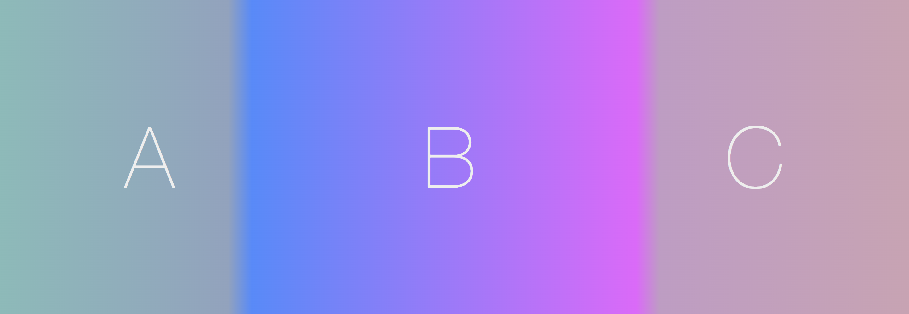

# Dynamic Gradient Split
#### A React component for animated split background gradients

Live demo: [gradient.bede.io](https://gradient.bede.io)

Because linear-gradient backgrounds can't be animated natively with CSS, this React component swaps between two components, using opacity to emulate animating linear-gradient natively at 60fps.

This is specifically geared towards linear gradients where one section of the gradient is saturated, and all other sections are desaturated.
